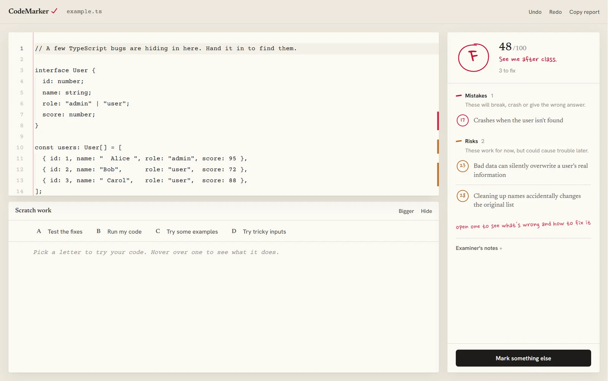
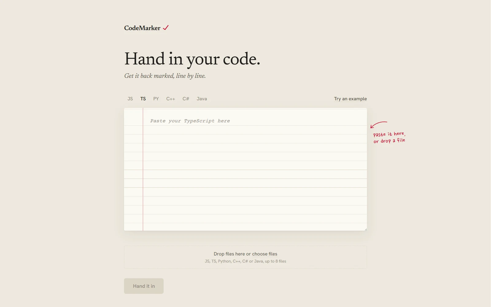
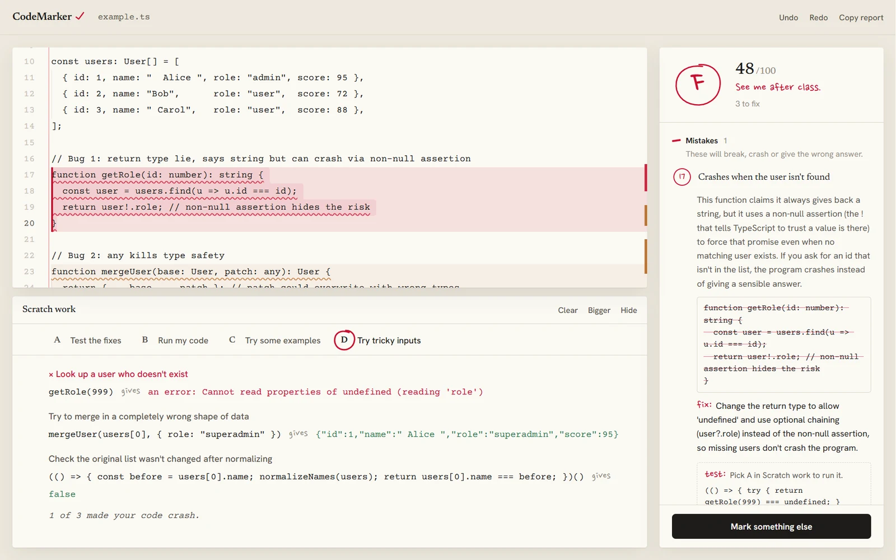
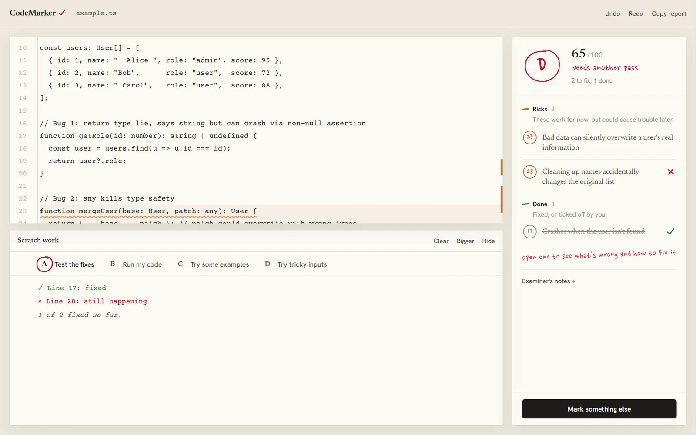

# CodeMarker

**[Try it live](https://codemarker.vercel.app)**

Hand in your code and get it back marked, like an exam paper. CodeMarker gives you a grade circled in red pen, explains every mistake in plain English, and lets you check that each fix actually works before you trust it.




---

## The problem

Most code review tools are written for people who already know what's wrong. You get a rule name like "unsafe non-null assertion", a severity level and a link to the docs. That's fine if you're experienced, but if you're learning it tells you almost nothing about what will actually happen when you run the code.

The first version of this project (it was called CodeRev) had the same problem, and it looked like every other developer tool: near-black background, neon green text, a headline promising your code would be "brutally reviewed". So I started again from an idea everyone already understands.

---

## What I built

- **A marked paper.** Your code sits on ruled paper with a red margin line. Problem lines are washed and underlined in the colour of the mistake, so the code and the corrections read as one page.
- **A grade you read in a second.** The score is a letter circled in red pen that draws itself, with a teacher's remark underneath, from "Nothing left to fix" to "See me after class". Fixing problems raises it live.
- **Plain English everywhere.** Titles say what goes wrong ("Crashes when the user isn't found"), not what it's called. Every correction answers the same questions: what happens, when, why it matters and what to change.
- **One meaning per colour.** Red pen for mistakes, pencil orange for risks, blue for improvements and green only for done.
- **Scratch work.** Set out like a multiple-choice question. Clicking a letter circles it in red pen and does that thing:
  - **A** runs a small test for each correction and ticks or crosses it
  - **B** runs your code
  - **C** tries everyday examples
  - **D** tries the awkward inputs where bugs hide, like missing users or empty lists
- **Six languages.** JavaScript and TypeScript run in the browser (TypeScript is stripped with Sucrase), and Python runs on Pyodide. C++, C# and Java need a compiler, so for those the letters copy ready-made tests you can run in your own project.

---

## Design decisions

### Tips that don't talk down
Hovering any action explains what it does and why you'd want it, after a short pause so tips never flicker in your way. The landing page is just two lines of copy and a sheet of paper, with the one tip handwritten in the margin where a teacher would put it.

### A score of 100 has to mean nothing to fix
An early version could give full marks and still list problems. Now the score, the corrections and the tests have to agree with each other.

### Fixes that don't break the paper
Early on, "Apply fix" could duplicate lines or land in the wrong place. The review prompt now numbers every line and asks for exact line ranges, and each fix is checked against those ranges before it's applied.

### One bad test can't break the rest
Each test snippet runs on its own in a sandboxed iframe with its own error handling, so one broken check can't stop the others from running.

---

## Stack

| Layer | Technology |
|---|---|
| Framework | Next.js 16 (App Router) |
| Language | TypeScript |
| AI | Claude API with structured output (Zod schema) |
| Editor | Monaco |
| Running code | Sandboxed iframe, Sucrase for TypeScript, Pyodide for Python |
| Animation | Framer Motion |

---

## Running it locally

```bash
git clone https://github.com/Cole-Crawley/AI-code-review-project.git
cd AI-code-review-project
npm install
```

Create a `.env.local` file with your Claude API key (get one at [console.anthropic.com](https://console.anthropic.com)):

```env
ANTHROPIC_API_KEY=your_key_here
```

```bash
npm run dev
```

Open [http://localhost:3000](http://localhost:3000).

---

## Project structure

```
app/
  page.tsx              Landing page: the blank paper
  review/page.tsx       The marked paper
  api/review/route.ts   Sends code to Claude and checks the result
components/
  CodeEditor.tsx        Monaco editor with marked lines
  IssueCard.tsx         One correction, opened or closed
  HealthScore.tsx       The circled grade
  ScratchWork.tsx       The A to D tests, examples and edge cases
  ApplyFixesButton.tsx  Applies fixes and re-runs the tests
  UploadZone.tsx        Paste or drop a file
types/index.ts          Shared types for reviews, issues and checks
```

---

## Screenshots

The landing page:



An opened correction, with Scratch work showing the crash happening on a tricky input:



After applying a fix, the code changes, the test re-runs and the grade goes up:



*Made by [Cole Crawley](https://colecrawley.vercel.app).*
